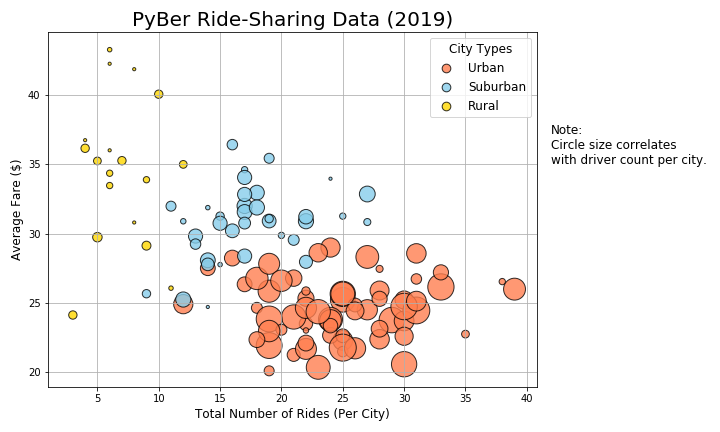
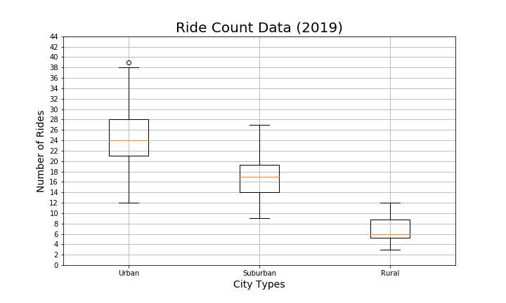
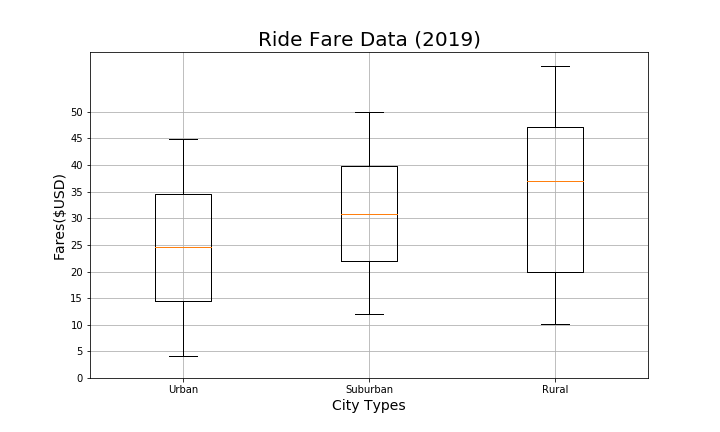
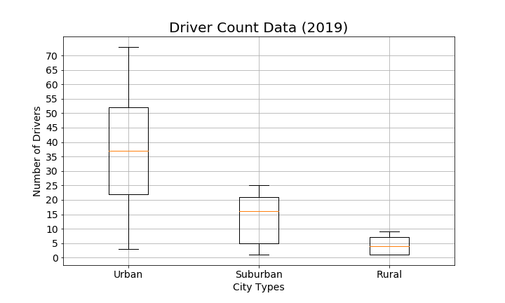
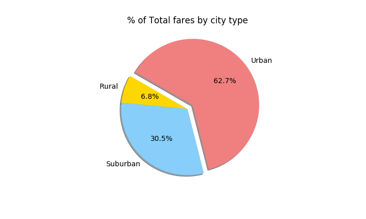
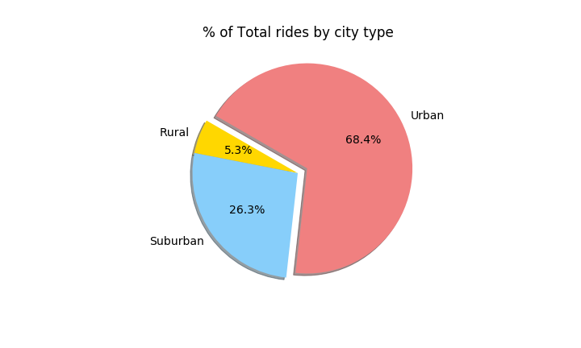
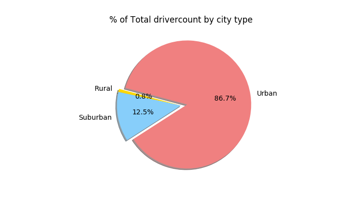
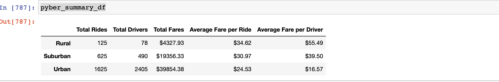
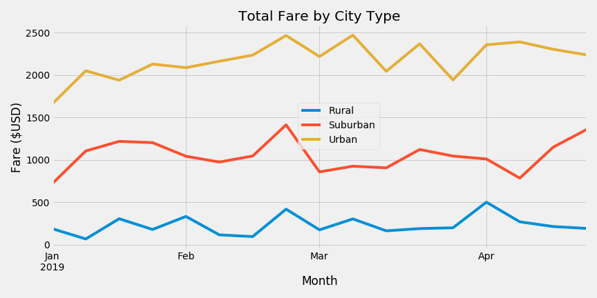

# PyBer_Analysis

## Overview:
   The project analyzes PyBer ride-sharing company's data and provides exploratory data analysis report to visualize the pattern between city types, fares, rides, and drivers. This would help PyBer to decide on how to improve the existing market and also expand to new cities.

## Exploratory Data Analysis:
   Using the Scatter chart we were able to bring the rides and fare relationship along with driver count. With our analysis Urban cities had the most number of rides with more drivers and fewer fares compared to Suburban and Rural. 
   
   Looked for outliers in the data to see if the data is clean, using Box and a Whisker chart we plotted data based on Ride Fares by City, Rides count per City and Driver Count per city. During the analysis we found there was one outlier in Rides count by the city in Urban, based on 3rd quartile data there could be 28 rides or below and 1st quartile data there could be 21 rides or below. Inter Quartile Data being 7 (3rd Quartile - 1st Quartile) and the outliers formula 1.5*IQR + 3rd Quartile = 1.5*7 + 28 = 38.5 or 1.5*IQR - 1st quartile = 10.5 - 21 = 10.5, based on IQR all values should be either greater than 10.5 or less than 38.5 rides count. In PyBer ridesharing case we have 39 rides in West Angela city which are greater than the maximum rides count which is an outlier. 
     
   
   
   
   Analyzed the data using the pie chart to see the contribution of each city type by different KPI. Created a pie chart to look into the Total percentage of fares by city type, Total percentage of rides count by city type and Total percentage of driver count by city type. Based on the analysis Urban cities had more contribution to fares, rides and driver count followed by Suburban and Rural. 
   
   
   

## Challenge:

### Overview:
    
   Based on the Scatter chart there were more rides in Urban followed by Suburban and Rural cities, also the plots looked much bigger based on the number of drivers in Urban followed by Suburban and Rural cities. One of the goals is to determine if there is any correlation between fares and rides count. The Box and a Whisker was good to see the outliers and it gave a perspective of one of the key metric either like rides count or fares or driver count by city type, but we missed a correlation how the fares did over a period of time. The second goal is to determine how the fares did over a period of time from Jan till Apr of 2019
   
### Analysis:

   Understanding the correlation between fares and rides count would help you to see if fares had an impact on the rides and also if the driver's count is also changing based on that. In the PyBer case when we look at the data it seems the Urban cities there were more rides, drivers and also the fares seem to be down. For example, rides count in Urban was 2.5 times more than Suburban and 13 times more than Rural. A similar pattern is seen in drivers count in Urban cities which was approx. 5 times more than Suburban and 30 times more than Rural cities. Total fares also had a somewhat closer pattern in Urban cities which was 2 times more than Suburban and 9 times more than Rural cities. We could derive some similarities and patterns which could lead us to the partial conclusion that Fares had an impact in the rides count and drivers count. There is some missing information though, like population, percentage of the population used ride-sharing, distance traveled, is the places well connected through public transit, etc.

   Looking through the lens of time period how the fares changed for different cities would give a different perspective for the analysis. In PyBer ridesharing case for the time period between Jan and Apr Total Fares changed for all the city types. While Jan, Feb had good total fare for the Urban city compared to Suburban and Rural, it peaked later in Feb and some time in Mar and Apr. Overall Urban cities had approx. 3 times the total fare of Suburban and 6 times total fare of Rural cities. 
