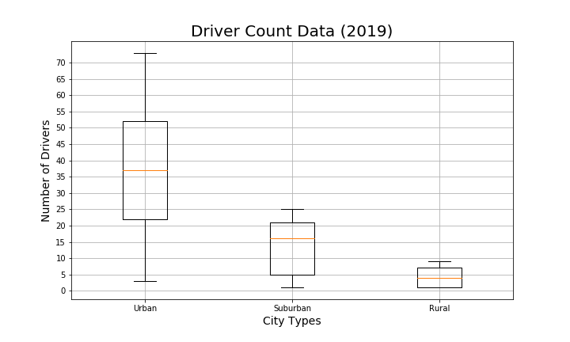

# PyBer_Analysis

## Overview:
   The project analyzes PyBer ride-sharing company's data and provides exploratory data analysis report to visualize the pattern between city types, fares, rides, and drivers. This would help PyBer to decide on how to improve the existing market and also expand to new cities.

## Exploratory Data Analysis:
   Using the Scatter chart we were able to bring the rides and fare relationship along with driver count. With our analysis Urban cities had the most number of rides with more drivers and fewer fares compared to Suburban and Rural. 
   
   Looked for outliers in the data to see if the data is clean, using Box and a Whisker chart we plotted data based on Ride Fares by City, Rides count per City and Driver Count per city. During the analysis we found there was one outlier in Rides count by the city in Urban, based on 3rd quartile data there could be 28 rides or below and 1st quartile data there could be 21 rides or below. Inter Quartile Data being 7 (3rd Quartile - 1st Quartile) and the outliers formula 1.5*IQR + 3rd Quartile = 1.5*7 + 28 = 38.5 or 1.5*IQR - 1st quartile = 10.5 - 21 = 10.5, based on IQR all values should be either greater than 10.5 or less than 38.5 rides count. In PyBer ridesharing case we have 39 rides in West Angela city which are greater than the maximum rides count which is an outlier. 
     
   
   
   
   Analyzed the data using the pie chart to see the contribution of each city type by different KPI. Created a pie chart to look into the Total percentage of fares by city type, Total percentage of rides count by city type and Total percentage of driver count by city type. Based on the analysis Urban cities had more contribution to fares, rides and driver count followed by Suburban and Rural. 
   
   
   
